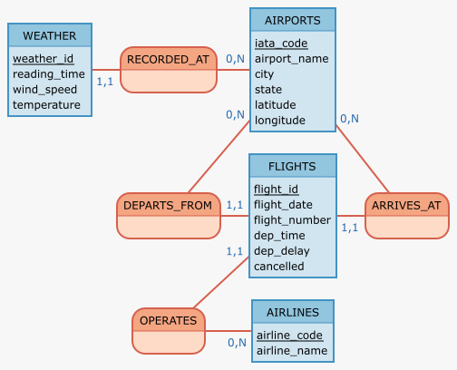
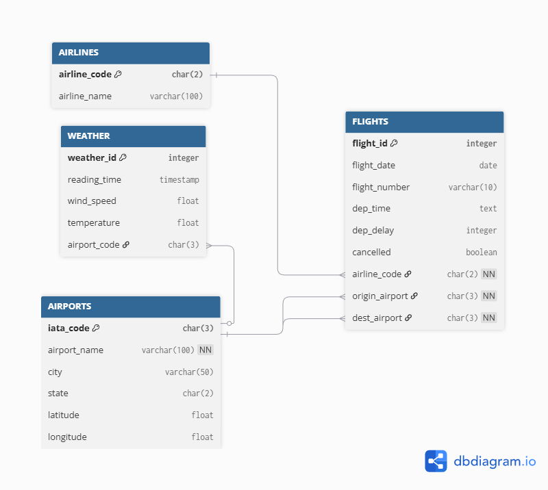

# Flight Delay & Weather Database

**Course:** Databases 1 (2025-2026) – Master 1  
**Authors:** Ayman EL ALASS & Abderaouf KHELFAOUI

## Description

This project models and creates a relational database between US flight delays and weather conditions. It includes scripts to parse raw CSV data, populate the database, and run analytical queries.

## Database Design

Here are the Conceptual (MCD) and Logical (MLD) models designed for this project, illustrating the relationships between Flights, Airlines, Airports, and Weather conditions.

### Conceptual Model (MCD)


### Logical Model (MLD)


## Data Sources

The raw data files are not included in this repository due to their size. Please download them from Kaggle and place them in the root folder:

1. **Flights:** [Kaggle Flight Delays](https://www.kaggle.com/datasets/usdot/flight-delays)
2. **Weather:** [Kaggle Historical Hourly Weather](https://www.kaggle.com/datasets/selfishgene/historical-hourly-weather-data)

## Installation

Here are the required dependencies:

```bash
pip install -r requirements.txt
````

## Usage

To generate the database and populate the tables, run:

```bash
python main.py
```

## Notebooks PDF

* **`query.pdf`**
* **`dataprocessing.pdf`**

## Report location

* **`report/report.pdf`**

## Project Structure

  * **`main.py`** : Main script that creates the database, cleans data, and populates tables.
  * **`query.ipynb`** : Notebook containing example SQL queries and business analysis.
  * **`query.pdf`** : PDF export of the query notebook.
  * **`dataprocessing.ipynb`** : Notebook containing data exploration and cleaning justification.
  * **`dataprocessing.pdf`** : PDF export of the data quality report.
  * **`script.sql`** : SQL script defining the database schema.
  * **`requirements.txt`** : List of Python libraries required
  * **`new_MCD.png`** : Image of the Conceptual Data Model.
  * **`new_MLD.png`** : Image of the Logical Data Model.
